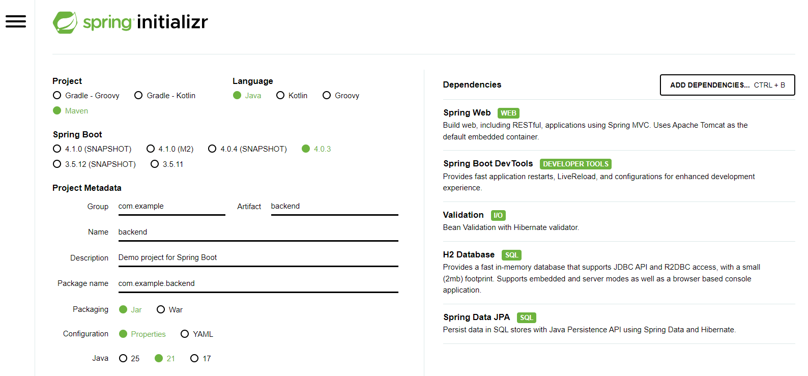

# Configuración inicial del backend

El proyecto backend se generó utilizando [https://start.spring.io](https://start.spring.io) con la siguiente configuración:

## Configuración general
- Project: Maven
- Language: Java
- Packaging: Jar
- Java: 21
- Spring Boot: 4.0.3

## Dependencias seleccionadas
- Spring Web
- Validation
- Spring Data JPA
- H2 Database
- Spring Boot DevTools
- Spring Boot Starter Test

  

